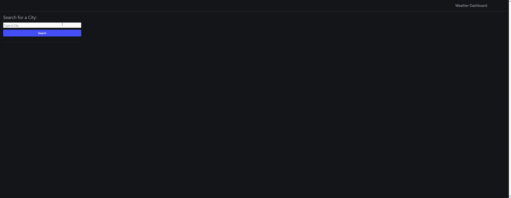

# Weather-Forecast
This is a simple weather application that allows users to search for a city and view its current weather for the next 3 hours and a 5-day forecast. 

## Features

- **Current Weather:** Displays the current weather conditions for the specified city including the forecast for the next 3 hours.
- **5-Day Forecast:** Provides a forecast for the next 5 days at midday, including temperature, humidity, and wind speed.
- **Local Storage:** Saves weather data for previously searched cities to local storage, allowing users to quickly access weather information for their favorite locations.

## Mock-Up

## Installation
There is no installation needed. To access the website [here](https://lolrb.github.io/Weather-Forecast/)

## Technologies Used

- **HTML:** Markup language for creating the structure of the web page.
- **CSS (Bulma Framework):** Stylesheet language for styling the web page. Utilizes the Bulma CSS framework for styling.
- **JavaScript:** Programming language for implementing interactive functionality.
- **OpenWeatherMap API:** Provides weather data for cities around the world.

## How to Use

1. **Search for a City:**
   - Enter the name of a city in the search input field.
   - Click the "Search" button to retrieve weather information for the specified city.

2. **View Weather Data:**
   - The current weather for the city will be displayed, including the forecast for the next 3 hours.
   - The 5-day weather forecast will also be displayed, showing the weather at midday for the next 5 days.

3. **Save and View Cities:**
   - Searched cities are saved to local storage and displayed as buttons.
   - Click on a city button in the "Cities" section to view saved weather data for that city.

## Code Structure

- **HTML:** The structure of the web page, including input fields, buttons, and containers for displaying weather data.
- **CSS:** Styling provided by the Bulma framework.
- **JavaScript:**
  - `cityApi()`: Fetches latitude and longitude data for the specified city.
  - `getApi(lat, lon, cityName)`: Fetches weather data using the latitude and longitude.
  - `displayTodaysWeather(data, cityName)`: Displays the weather for the next 3 hours for the specified city.
  - `displayNextFiveDaysWeather(data, cityName)`: Displays the 5-day weather forecast for the specified city.
  - `saveToLocalStorage(cityName, data)`: Saves weather data to local storage.
  - `createCityButton(cityName, data)`: Creates a button for each saved city.
  - `displayWeatherDay(dayData, dayLabel, container)`: Helper function to display weather data for a specific day.

## External Dependencies

- [Bulma CSS](https://bulma.io/): CSS framework used for styling the pages.
- [OpenWeatherMap API](https://openweathermap.org/): API used to retrieve weather data.

## Acknowledgements
This project was created as part of a learning exercise and may contain simplistic implementations.